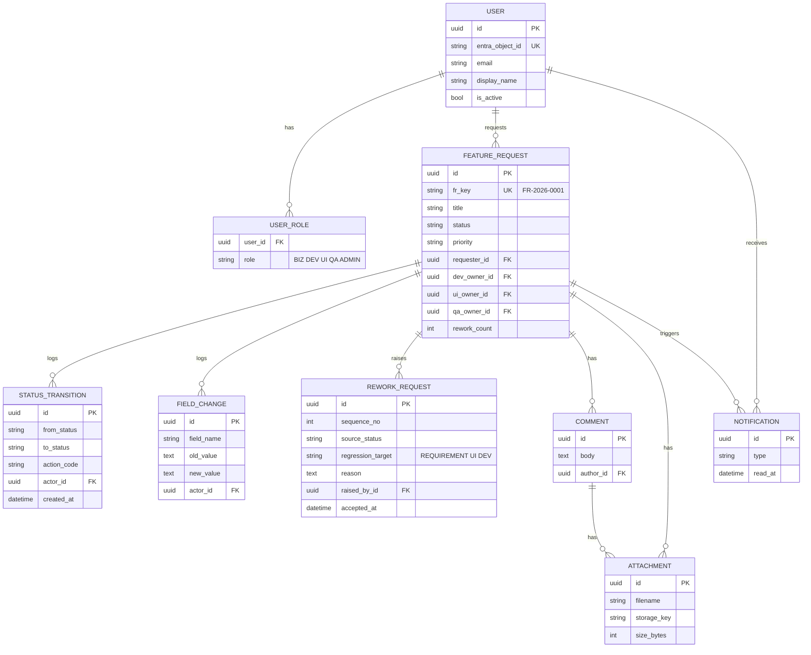
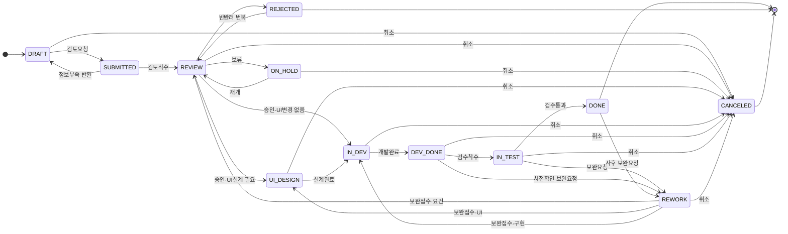

# FRMS 데이터 모델 및 워크플로 정의

| 항목 | 내용 |
|---|---|
| 문서 상태 | Draft |
| 버전 | 0.1 |
| 작성일 | 2026-08-26 |
| 관련 문서 | [PRD](./PRD.md) · [플랫폼 결정 기록](./platform-decision.md) · [로드맵](./roadmap.md) |

이 문서는 [PRD](./PRD.md)의 부속 문서로, 요구사항 하나가 시스템 안에서 **어떤 데이터로
표현되고 어떤 규칙에 따라 단계를 옮겨 다니는지**를 확정한다. PRD 본문의 기능 요구사항
`FR-2xx`(워크플로), `FR-3xx`(보완요청), `FR-4xx`(권한)의 구현 기준이 된다.

---

## 1. 개념 개요

- 관리 단위는 **기능 요구사항(Feature Request, FR)** 1건이다.
- FR은 항상 정확히 하나의 **상태(status)** 를 가진다. 상태는 곧 "지금 누가 공을 쥐고 있는가"다.
- 상태를 바꾸는 행위는 **전이(transition)** 이며, 모든 전이는 이력으로 남는다.
- 검수에서 문제가 발견되면 **보완요청(ReworkRequest)** 이 생성되고, 이때
  **어디로 되돌아가는지(회귀 대상)를 반드시 지정**한다. 이 값이 보완요청의 핵심이다.

---

## 2. ER 개요

---

## 3. 상태 정의

| 상태 | 코드 | 공을 쥔 역할 | 의미 | 종류 |
|---|---|---|---|---|
| 작성중 | `DRAFT` | 사업담당 | 요구사항 초안 입력 중. 제출 전까지 자유롭게 수정 | 진행 |
| 접수 | `SUBMITTED` | 개발·UI담당 | 검토 요청이 제출되어 검토 착수를 기다림 | 진행 |
| 요건검토 | `REVIEW` | 개발·UI담당 | 실현가능성·공수 산정, 승인/보류/반려 판단 | 진행 |
| 보류 | `ON_HOLD` | 사업담당 | 우선순위에 밀려 보관. 재개 전까지 진행 없음 | 대기 |
| 반려 | `REJECTED` | — | 진행 불가로 종결. 번복 시 요건검토로 복귀 | 종결 |
| UI설계 | `UI_DESIGN` | UI담당 | 화면·플로우 설계 및 확정 | 진행 |
| 개발중 | `IN_DEV` | 개발담당 | 구현 진행 | 진행 |
| 개발완료 | `DEV_DONE` | 개발담당 | 구현 완료, 검수 착수 대기 | 진행 |
| 검수중 | `IN_TEST` | 검수담당 | 검수 기준에 따른 테스트 수행 | 진행 |
| 보완요청 | `REWORK` | 회귀 대상 담당자 | 보완 사항이 접수되기를 기다림 (회귀 대상 지정 완료) | 진행 |
| 완료 | `DONE` | — | 검수 통과 및 반영 완료 | 종결 |
| 취소 | `CANCELED` | — | 요청 철회로 종결 | 종결 |

**상태 코드 규칙**: 대문자 스네이크케이스, 영문 고정. UI 표기 문자열은 프론트엔드
사전에서 관리하며, DB·API는 코드값만 사용한다.

---

## 4. 상태 다이어그램

---

## 5. 상태 전이 매트릭스

전이는 `(from, to, 허용 역할, 필수 입력, 알림 대상)` 5튜플로 정의한다.
표에 없는 조합은 **모두 금지**이며, API는 400으로 거부한다 (`FR-201`, `FR-202`, `FR-203`).

역할 약어: **BIZ** 사업담당 · **DEV** 개발담당 · **UI** UI담당 · **QA** 검수담당 · **ADMIN** 관리자

| # | from | to | action_code | 허용 역할 | 필수 입력 | 알림 대상 |
|---|---|---|---|---|---|---|
| T01 | — | `DRAFT` | `CREATE` | BIZ, ADMIN | 제목, 상세내용, 대상제품, 기능구분 | — |
| T02 | `DRAFT` | `SUBMITTED` | `SUBMIT` | 요청자 본인, ADMIN | 우선순위, 희망완료일, 완료조건 | DEV·UI 역할 전체 |
| T03 | `SUBMITTED` | `REVIEW` | `START_REVIEW` | DEV, UI, ADMIN | 개발담당 지정 | 요청자, 지정된 담당자 |
| T04 | `SUBMITTED` | `DRAFT` | `RETURN` | DEV, UI, ADMIN | 반환 사유 | 요청자 |
| T05 | `REVIEW` | `UI_DESIGN` | `APPROVE_WITH_UI` | 개발담당, ADMIN | 예상공수, 목표완료일, UI담당·검수담당 지정 | 요청자, UI담당, 검수담당 |
| T06 | `REVIEW` | `IN_DEV` | `APPROVE_NO_UI` | 개발담당, ADMIN | 예상공수, 목표완료일, 검수담당 지정 | 요청자, 검수담당 |
| T07 | `REVIEW` | `ON_HOLD` | `HOLD` | BIZ, 개발담당, ADMIN | 보류 사유, 재검토 예정일 | 요청자, 담당자 전원 |
| T08 | `REVIEW` | `REJECTED` | `REJECT` | 개발담당, ADMIN | 반려 사유 | 요청자 |
| T09 | `ON_HOLD` | `REVIEW` | `RESUME` | BIZ, ADMIN | — | 담당자 전원 |
| T10 | `REJECTED` | `REVIEW` | `REOPEN` | BIZ, ADMIN | 재검토 사유 | 담당자 전원 |
| T11 | `UI_DESIGN` | `IN_DEV` | `UI_DONE` | UI담당, ADMIN | 설계 산출물 링크 또는 첨부 1건 이상 | 개발담당, 검수담당 |
| T12 | `IN_DEV` | `DEV_DONE` | `DEV_DONE` | 개발담당, ADMIN | 개발결과 요약, 검증 환경 | 검수담당, 요청자 |
| T13 | `DEV_DONE` | `IN_TEST` | `START_TEST` | 검수담당, ADMIN | — | 개발담당 |
| T14 | `IN_TEST` | `DONE` | `PASS` | 검수담당, ADMIN | 검수 결과 요약 | 요청자, 개발담당, UI담당 |
| T15 | `IN_TEST` | `REWORK` | `REQUEST_REWORK` | 검수담당, ADMIN | **회귀 대상**, 보완 내용, 심각도 | 회귀 대상 담당자, 요청자 |
| T16 | `DEV_DONE` | `REWORK` | `REQUEST_REWORK_PRE` | BIZ, 검수담당, ADMIN | **회귀 대상**, 보완 내용 | 회귀 대상 담당자, 검수담당 |
| T17 | `DONE` | `REWORK` | `REQUEST_REWORK_POST` | BIZ, 검수담당, ADMIN | **회귀 대상**, 보완 내용, 발견 경위 | 담당자 전원 |
| T18 | `REWORK` | `REVIEW` | `ACCEPT_REWORK_REQ` | BIZ, ADMIN | — (회귀 대상 = `REQUIREMENT`일 때만) | 개발담당, UI담당 |
| T19 | `REWORK` | `UI_DESIGN` | `ACCEPT_REWORK_UI` | UI담당, ADMIN | — (회귀 대상 = `UI`일 때만) | 개발담당, 검수담당 |
| T20 | `REWORK` | `IN_DEV` | `ACCEPT_REWORK_DEV` | 개발담당, ADMIN | — (회귀 대상 = `DEV`일 때만) | 검수담당 |
| T21 | `DRAFT` | `CANCELED` | `CANCEL` | 요청자 본인, ADMIN | 취소 사유 | — |
| T22 | `REVIEW`·`ON_HOLD`·`UI_DESIGN`·`IN_DEV`·`DEV_DONE`·`IN_TEST`·`REWORK` | `CANCELED` | `CANCEL` | 요청자 본인, BIZ, ADMIN | 취소 사유 | 담당자 전원 |

### 전이 규칙 보충

1. **"요청자 본인"** 은 `requester_id`와 로그인 사용자가 같을 때만 성립한다.
   "개발담당/UI담당/검수담당"도 마찬가지로 해당 FR에 **지정된 담당자 본인**을 뜻한다.
   역할만 보유하고 해당 FR에 지정되지 않은 사용자는 전이할 수 없다 (`FR-202`).
   단 `T03`·`T04`는 아직 담당자가 없으므로 역할 보유만으로 가능하다.
2. **T18~T20은 회귀 대상 값이 일치할 때만 노출·허용**한다. 회귀 대상이 `DEV`인
   보완요청을 UI담당이 `ACCEPT_REWORK_UI`로 접수하는 것은 금지다.
3. `ADMIN`은 모든 전이를 수행할 수 있으나, 이력에 `actor_role=ADMIN`으로 기록되어
   일반 전이와 구분된다. 운영 사고 복구용이며 일상 사용을 권장하지 않는다.
4. 종결 상태(`DONE`, `REJECTED`, `CANCELED`) 중 **`CANCELED`만 최종**이다.
   `DONE`은 사후 보완요청(T17)으로, `REJECTED`는 번복(T10)으로 되살아날 수 있다.
5. 모든 전이는 `STATUS_TRANSITION` 1건을 생성한다 (`FR-701`). 실패한 전이 시도는
   기록하지 않는다.

---

## 6. 역할 × 권한 매트릭스

### 6.1 기능 단위 권한

C=생성, R=조회, U=수정, D=삭제, ○=가능, —=불가

| 기능 | BIZ 사업담당 | DEV 개발담당 | UI UI담당 | QA 검수담당 | ADMIN |
|---|---|---|---|---|---|
| 요구사항 생성 | C | — | — | — | C |
| 요구사항 조회 | R (전체) | R (전체) | R (전체) | R (전체) | R (전체) |
| 요청 정보 수정 | U | — | — | — | U |
| 계획 정보 수정 | — | U | — | — | U |
| UI 정보 수정 | — | — | U | — | U |
| 검수 정보 수정 | — | — | — | U | U |
| 담당자 지정 | UI·검수담당 지정 가능 | 전 담당자 지정 가능 | — | — | ○ |
| 상태 전이 | 5절 매트릭스에 따름 | 5절 매트릭스에 따름 | 5절 매트릭스에 따름 | 5절 매트릭스에 따름 | 전체 |
| 보완요청 생성 | ○ (T16, T17) | — | — | ○ (T15~T17) | ○ |
| 코멘트 작성 | C, U/D(본인) | C, U/D(본인) | C, U/D(본인) | C, U/D(본인) | C, D(전체) |
| 첨부 업로드 | C, D(본인) | C, D(본인) | C, D(본인) | C, D(본인) | C, D(전체) |
| 대시보드 조회 | R | R | R | R | R |
| 사용자·역할 관리 | — | — | — | — | C R U D |
| 감사 로그 조회 | — | — | — | — | R |

**조회는 전 역할 전체 공개**가 원칙이다. 20명 규모에서 열람 권한을 나누면 정보 단절만
심해지고 얻는 게 없다. 통제는 **쓰기와 전이**에만 건다.

### 6.2 필드 그룹별 편집 가능 상태

수정 권한은 역할뿐 아니라 **현재 상태**에도 걸린다 (`FR-103`).

| 필드 그룹 | 포함 필드 | 편집 역할 | 편집 가능 상태 |
|---|---|---|---|
| 요청 정보 | `title`, `background`, `description`, `acceptance_criteria`, `product`, `category`, `priority`, `desired_due_date` | BIZ(요청자), ADMIN | `DRAFT`, `SUBMITTED`, `REVIEW`, `ON_HOLD`, `REWORK`(회귀 대상=`REQUIREMENT`) |
| 계획 정보 | `dev_owner_id`, `ui_owner_id`, `qa_owner_id`, `estimate_md`, `target_due_date`, `ui_change_required` | DEV(개발담당), ADMIN | `REVIEW`, `UI_DESIGN`, `IN_DEV`, `DEV_DONE`, `REWORK` |
| UI 정보 | `ui_design_url`, UI 설계 첨부 | UI(UI담당), ADMIN | `REVIEW`, `UI_DESIGN`, `IN_DEV`, `REWORK` |
| 검수 정보 | `test_result_summary`, `test_env` | QA(검수담당), ADMIN | `DEV_DONE`, `IN_TEST`, `REWORK` |
| 협업 | 코멘트, 첨부 | 전 역할 | 종결 상태(`DONE`, `REJECTED`, `CANCELED`) 제외 전 상태 |

> **승인 이후 요건 변경은 직접 수정이 불가능하다.** `UI_DESIGN` 이후 요청 정보를 바꾸려면
> 보완요청(회귀 대상 = `REQUIREMENT`)을 거쳐야 한다. 이렇게 해야 "요구사항이 조용히
> 바뀌어서 개발이 헛돌았다"는 사고가 이력에 남는다.

---

## 7. 엔티티 상세

### 7.1 `feature_request`

| 필드 | 타입 | 필수 | 기본값 | 설명 |
|---|---|---|---|---|
| `id` | uuid | ○ | 자동 | PK |
| `fr_key` | varchar(16) | ○ | 자동 | 사용자 노출 ID. `FR-YYYY-NNNN` |
| `title` | varchar(200) | ○ | — | 한 줄 요약 |
| `background` | text | — | — | 요청 배경·목적 |
| `description` | text | ○ | — | 상세 요구 내용 |
| `acceptance_criteria` | text | ○(제출 시) | — | 완료 조건. 검수 기준의 근거 |
| `product` | varchar(64) | ○ | — | 대상 IoT 제품·디바이스·서비스 |
| `category` | enum | ○ | — | `NEW_FEATURE` / `IMPROVEMENT` / `DEFECT` / `OPS_REQUEST` |
| `priority` | enum | ○(제출 시) | `P2` | `P0`(긴급) / `P1`(높음) / `P2`(보통) / `P3`(낮음) |
| `status` | enum | ○ | `DRAFT` | 3절 상태 코드 |
| `requester_id` | uuid FK | ○ | 로그인 사용자 | 요청자(사업담당) |
| `dev_owner_id` | uuid FK | — | null | 개발담당 |
| `ui_owner_id` | uuid FK | — | null | UI담당 |
| `qa_owner_id` | uuid FK | — | null | 검수담당 |
| `ui_change_required` | bool | ○ | `true` | false면 `UI_DESIGN` 단계를 건너뜀 (`FR-207`) |
| `estimate_md` | numeric(5,1) | — | null | 예상 공수(MD) |
| `desired_due_date` | date | — | null | 사업담당 희망 완료일 |
| `target_due_date` | date | — | null | 승인 시 확정한 목표 완료일. 지연 판정 기준 |
| `ui_design_url` | varchar(500) | — | null | UI 설계 산출물 링크 |
| `test_env` | varchar(120) | — | null | 검증 환경 |
| `test_result_summary` | text | — | null | 검수 결과 요약 |
| `rework_count` | int | ○ | `0` | 누적 보완요청 횟수 (`FR-303`) |
| `closed_reason` | text | — | null | 반려·취소 사유 |
| `created_at` | timestamptz | ○ | now | 생성 시각 |
| `updated_at` | timestamptz | ○ | now | 최종 수정 시각 |
| `submitted_at` | timestamptz | — | null | 최초 제출 시각. 리드타임 시작점 |
| `approved_at` | timestamptz | — | null | 최초 승인(T05/T06) 시각 |
| `dev_done_at` | timestamptz | — | null | 최초 개발완료 시각 |
| `done_at` | timestamptz | — | null | 완료 시각. 리드타임 종료점 |

**인덱스**: `status`, `requester_id`, `dev_owner_id`, `ui_owner_id`, `qa_owner_id`,
`target_due_date`, `(status, priority)`. 20명·연 600건 규모에서는 이 정도면 충분하다.

### 7.2 `status_transition`

| 필드 | 타입 | 필수 | 설명 |
|---|---|---|---|
| `id` | uuid | ○ | PK |
| `feature_request_id` | uuid FK | ○ | 대상 FR |
| `from_status` | varchar(16) | — | 생성(T01)일 때 null |
| `to_status` | varchar(16) | ○ | 전이 후 상태 |
| `action_code` | varchar(32) | ○ | 5절 `action_code` |
| `actor_id` | uuid FK | ○ | 수행자 |
| `actor_role` | varchar(8) | ○ | 수행 시점의 역할 |
| `comment` | text | — | 사유·메모 |
| `payload` | jsonb | — | 전이 필수 입력값 스냅샷 |
| `created_at` | timestamptz | ○ | 전이 시각 |

`from_status`와 `created_at`으로 **단계별 체류시간**을 계산한다. 별도 집계 컬럼을 두지
않고 이 테이블에서 파생한다.

### 7.3 `rework_request`

| 필드 | 타입 | 필수 | 설명 |
|---|---|---|---|
| `id` | uuid | ○ | PK |
| `feature_request_id` | uuid FK | ○ | 대상 FR |
| `sequence_no` | int | ○ | 해당 FR 내 회차 (1부터) |
| `source_status` | varchar(16) | ○ | 보완요청이 제기된 상태 (`IN_TEST`/`DEV_DONE`/`DONE`) |
| `regression_target` | enum | ○ | **`REQUIREMENT` / `UI` / `DEV`** — 어디로 되돌리는가 |
| `severity` | enum | ○ | `BLOCKER` / `MAJOR` / `MINOR` |
| `reason` | text | ○ | 보완이 필요한 이유와 내용 |
| `raised_by_id` | uuid FK | ○ | 제기자 |
| `raised_at` | timestamptz | ○ | 제기 시각 |
| `accepted_by_id` | uuid FK | — | 접수자 (T18~T20 수행자) |
| `accepted_at` | timestamptz | — | 접수 시각 |
| `resolved_at` | timestamptz | — | 해당 회차가 다시 `DEV_DONE`에 도달한 시각 |

`regression_target`이 이 시스템의 **가장 중요한 단일 필드**다. "보완요청이 요건 문제인지,
UI 문제인지, 구현 문제인지"를 강제로 분류하게 만들어, 반복되는 병목의 원인을 드러낸다.

### 7.4 `field_change`

| 필드 | 타입 | 필수 | 설명 |
|---|---|---|---|
| `id` | uuid | ○ | PK |
| `feature_request_id` | uuid FK | ○ | 대상 FR |
| `field_name` | varchar(64) | ○ | 변경된 필드 |
| `old_value` | text | — | 이전 값 (긴 텍스트는 앞 1,000자) |
| `new_value` | text | — | 변경 값 |
| `actor_id` | uuid FK | ○ | 수행자 |
| `created_at` | timestamptz | ○ | 변경 시각 |

### 7.5 `user` / `user_role`

| 필드 | 타입 | 필수 | 설명 |
|---|---|---|---|
| `user.id` | uuid | ○ | PK |
| `user.entra_object_id` | varchar(64) | ○ | Entra ID 사용자 고유값. UNIQUE. 로그인 매칭 키 |
| `user.email` | varchar(200) | ○ | 표시·알림용 |
| `user.display_name` | varchar(100) | ○ | 표시 이름 |
| `user.is_active` | bool | ○ | 비활성 사용자는 담당자로 지정 불가 |
| `user.last_login_at` | timestamptz | — | 최종 로그인 |
| `user_role.user_id` | uuid FK | ○ | 대상 사용자 |
| `user_role.role` | enum | ○ | `BIZ` / `DEV` / `UI` / `QA` / `ADMIN` |

`user_role`은 (user_id, role) 복합 UNIQUE. **한 사용자가 여러 역할을 가질 수 있다**
(`FR-404`). 20명 규모에서는 개발담당이 검수도 겸하는 경우가 흔하다. 단, 같은 FR에서
개발담당과 검수담당을 동시에 맡는 것은 **경고를 표시하되 차단하지는 않는다** —
소규모 조직에서 물리적으로 불가피한 경우가 있기 때문이다.

### 7.6 `comment` / `attachment` / `notification` (Phase 2)

| 엔티티 | 핵심 필드 |
|---|---|
| `comment` | `id`, `feature_request_id`, `author_id`, `body`, `parent_id`, `mentioned_user_ids` (uuid[]), `created_at`, `updated_at`, `deleted_at` |
| `attachment` | `id`, `feature_request_id`, `comment_id`(nullable), `uploader_id`, `filename`, `content_type`, `size_bytes`, `storage_key`, `created_at` |
| `notification` | `id`, `user_id`, `feature_request_id`, `type`, `payload` (jsonb), `read_at`, `created_at` |

`notification`은 Phase 1에서도 앱 내 알림(`FR-601`)을 위해 생성한다. 이메일 발송
(`FR-605`)은 Phase 2에서 이 테이블을 소스로 붙인다.

---

## 8. ID 채번 규칙

- 형식: `FR-YYYY-NNNN` (예: `FR-2026-0042`)
- `YYYY`는 **생성 연도**, `NNNN`은 해당 연도 내 4자리 일련번호이며 매년 0001로 초기화된다.
- 채번은 생성(T01) 시점, 즉 `DRAFT` 진입 시 확정하고 이후 변경하지 않는다.
  취소·반려된 번호도 재사용하지 않는다.
- 연 10,000건 초과 시 자릿수를 늘린다. 현재 규모(월 20~50건)에서는 발생하지 않는다.

---

## 9. 파생 지표 계산 정의

PRD 10절 성공 지표의 계산 근거다. 별도 집계 테이블 없이 위 테이블에서 파생한다.

| 지표 | 계산식 |
|---|---|
| 리드타임 | `done_at - submitted_at` (완료 건만) |
| 단계별 체류시간 | `status_transition`에서 동일 FR의 연속한 두 전이 시각 차이를 `from_status`별로 집계 |
| 보완요청률 | `rework_count > 0`인 완료 건 수 ÷ 전체 완료 건 수 |
| 첫 검수 통과율 | `rework_count = 0`으로 `DONE`에 도달한 건 수 ÷ 전체 완료 건 수 |
| 회귀 원인 분포 | `rework_request.regression_target`별 건수 비중 |
| 기한 준수율 | `done_at::date <= target_due_date`인 건 수 ÷ `target_due_date`가 설정된 완료 건 수 |
| 지연 건 | 종결 상태가 아니면서 `target_due_date < 오늘`인 건 |
