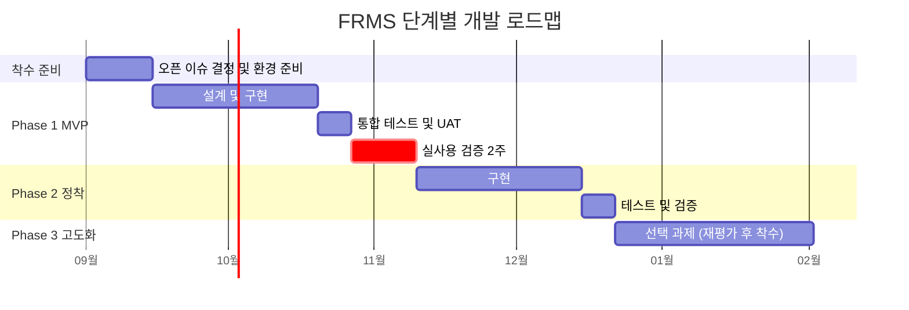

# FRMS 단계별 개발 로드맵

| 항목 | 내용 |
|---|---|
| 문서 상태 | Draft — 검토 요청 |
| 버전 | 0.1 |
| 작성일 | 2026-08-26 |
| 관련 문서 | [PRD](./PRD.md) · [데이터 모델](./data-model.md) · [플랫폼 결정 기록](./platform-decision.md) |

---

## 1. 원칙

> **각 Phase는 종료 조건(Exit Criteria)을 충족해야 다음 Phase에 착수한다.**
> 일정이 밀린다는 이유로 종료 조건을 건너뛰지 않는다.

이 원칙에서 파생되는 규칙:

1. **각 Phase는 그 자체로 쓸모 있어야 한다.** Phase 1에서 중단해도 요구사항 관리가
   가능한 상태여야 한다. "Phase 2가 나와야 비로소 쓸 수 있는 Phase 1"은 설계 실패다.
2. **Must 항목을 기준으로 범위를 정한다.** Should/Could는 그 단계의 검증에 반드시
   필요한 경우에만 예외로 포함하고, 포함 이유를 명시한다. 그 외에는 다음 Phase로 보낸다.
   범위를 늘리자는 요청은 "그럼 무엇을 빼는가"와 함께 논의한다.
3. **Exit Criteria는 실사용 데이터로 판정한다.** "개발 완료"가 아니라 "실제로 그렇게
   쓰이고 있다"가 기준이다.
4. **Phase 종료마다 회고한다.** 특히 Phase 1 종료 시에는 [상태 설계 자체를 재검토](#54-phase-1-종료-회고-항목)한다.

기간은 **개발 1명 상근 기준의 추정치**이며, 실제 투입 인력이 확정되면(오픈 이슈 O6)
재산정한다.

---

## 2. 전체 개관

| Phase | 목표 | 기간(추정) | 핵심 산출물 |
|---|---|---|---|
| **착수 준비** | 결정 사항 확정, 개발 환경 구축 | 2주 | 오픈 이슈 O1·O3·O6·O7 결정, Entra 앱 등록, 저장소·CI 구성 |
| **Phase 1 — MVP** | 요구사항이 시스템 안에서 단계를 따라 흐르게 만든다 | 6주 + 실사용 2주 | 동작하는 웹앱 (등록·전이·보완요청·칸반·내 할 일) |
| **Phase 2 — 정착** | 지표로 병목을 보고, 시스템 안에서 소통한다 | 6주 | 대시보드, 코멘트·첨부, 이메일·지연 알림, 이력 타임라인 |
| **Phase 3 — 고도화** | 필요성이 확인된 확장만 선별 착수 | 재평가 후 결정 | 리포트, 릴리즈 묶음, API, Teams 알림, 이슈트래커 연동 |

---

## 3. 착수 준비 (2주, 개발 없음)

Phase 1 착수 **전에** 반드시 끝내야 하는 것들이다. 여기서 막히면 개발이 헛돈다.

| 할 일 | 관련 | 담당 |
|---|---|---|
| 호스팅 위치 확정 | 오픈 이슈 O1 / [재검토 조건 C1](./platform-decision.md#6-이-결정을-재검토해야-하는-조건) | 인프라·보안 |
| Entra ID 앱 등록 및 리다이렉트 URI 확정 | 오픈 이슈 O3 / 재검토 조건 C2 | IT 관리자 |
| 투입 개발 리소스 확정 | 오픈 이슈 O6 / 재검토 조건 C3 | 개발담당 |
| 대상 제품(`product`) 선택지 목록 확정 | 오픈 이슈 O7 | 사업담당 |
| 역할 배정표 작성 | 오픈 이슈 O8 | 전체 |
| 저장소·CI·개발/운영 환경 준비 | — | 개발담당 |

**착수 준비 종료 조건**: O1·O3·O6·O7이 모두 결정되었고, [플랫폼 결정 재검토 조건](./platform-decision.md#6-이-결정을-재검토해야-하는-조건)
C1~C3이 모두 거짓임이 확인되었다. **하나라도 참이면 Phase 1에 착수하지 않고 플랫폼
결정을 다시 연다.**

---

## 4. Phase 1 — MVP (6주 + 실사용 검증 2주)

### 4.1 이 단계가 답해야 하는 질문

> "우리가 정의한 12개 상태와 22개 전이가 실제 업무와 맞는가?"

기능을 늘리는 단계가 아니라 **워크플로 설계가 옳은지 검증하는 단계**다.

### 4.2 범위

Must 항목 전부와, 이 단계의 검증에 필요한 Should 항목 4건이다.

| 영역 | 포함 FR |
|---|---|
| 인증·권한 | FR-401, FR-402, FR-403, FR-404\* |
| 요구사항 관리 | FR-101, FR-102, FR-103, FR-104, FR-105, FR-108, FR-109 |
| 워크플로 | FR-201, FR-202, FR-203, FR-204, FR-205, FR-206, FR-207, FR-208 |
| 보완요청 | FR-301, FR-302, FR-303, FR-304\* |
| 가시화 | FR-501, FR-502, FR-503, FR-504, FR-505, FR-508, FR-509\* |
| 알림 | FR-601 (**앱 내 알림만**) |
| 이력 | FR-701, FR-702\* (기록만. 전용 타임라인 UI는 Phase 2) |

\* 우선순위가 Should이지만 Phase 1에 포함한 항목과 그 이유:

| FR | 항목 | Phase 1에 포함한 이유 |
|---|---|---|
| FR-404 | 복수 역할 보유 | 20명 규모에서는 겸직이 기본값이다. 나중에 붙이면 역할 모델을 다시 설계해야 한다 |
| FR-304 | 사후 보완요청 | `DONE → REWORK` 전이가 빠지면 완료 후 결함을 시스템 밖에서 처리하게 되어, 종료 조건 X1-2(100% 경유)가 깨진다 |
| FR-509 | 뷰·필터 상태 URL 반영 | 화면 링크를 공유하지 못하면 사용자가 채널 대화로 되돌아간다 |
| FR-702 | 필드 변경 이력 기록 | **기록은 소급이 불가능하다.** UI는 Phase 2로 미루더라도 기록은 처음부터 남겨야 한다 |

### 4.3 명시적 제외

Phase 1에 **넣지 않는다.** 요청이 들어와도 Phase 2로 보낸다.

- 대시보드·지표 화면 (FR-506)
- 코멘트·멘션·첨부파일 (FR-602~604)
- 이메일 알림, 지연 경고 (FR-605, FR-606)
- 키워드 검색, 저장 필터 (FR-106, FR-107)
- 이력 타임라인 UI (FR-703)
- **MS Teams 연동 일체** (FR-804) — [결정 기록](./platform-decision.md) 참조

### 4.4 구현 순서

의존 관계를 고려한 권장 순서다.

1. **전이 매트릭스를 코드 안 단일 선언 테이블로 구현** — 이것이 제품의 심장이다.
   권한 검증·필수 입력 검증·UI 버튼 노출·내 할 일 큐가 모두 여기서 파생된다.
2. 데이터 모델 및 마이그레이션 (`feature_request`, `status_transition`, `rework_request`, `field_change`, `user`, `user_role`, `notification`)
3. Entra ID 인증 및 역할 기반 인가 미들웨어
4. 요구사항 CRUD API + 필드 그룹별 편집 권한
5. 전이 API (`POST /fr/{key}/transitions`) + 이력 기록
6. 보완요청 생성·접수 (회귀 대상 분류 강제)
7. 상세 화면 (진행 스테퍼 + 수행 가능한 전이 버튼)
8. 칸반 보드 + 카드 뱃지
9. 내 할 일 큐
10. 목록 뷰 + 필터, 관리자 화면(사용자·역할)

### 4.5 테스트 전략

| 계층 | 대상 | 기준 |
|---|---|---|
| 단위 | 전이 매트릭스 판정 로직, 권한 판정, 필수 입력 검증, 지표 계산식 | **전이 매트릭스 22건 전건 + 대표적인 금지 조합**에 대한 테스트 케이스 존재 |
| 통합(API) | 전이 API, CRUD API, 인가 미들웨어 | 허용 역할이 아닌 사용자의 전이 시도가 모두 403/400으로 거부되는지 |
| E2E | 상태 전이 시나리오 | 아래 필수 시나리오 전건 통과 |
| UAT | 4개 역할별 체크리스트 | 각 역할 담당자가 직접 수행하고 서명 |

**필수 E2E 시나리오** (최소 8종):

| # | 시나리오 | 검증 포인트 |
|---|---|---|
| E1 | 정상 경로 (UI 변경 있음): 등록 → 제출 → 검토 → 승인(UI) → UI설계 → 개발 → 검수 → 완료 | 전 단계 정상 흐름 |
| E2 | 정상 경로 (UI 변경 없음): 승인 시 UI설계 생략 | FR-207 |
| E3 | 검수 반려 → 회귀 대상 `DEV` → 개발담당 접수 → 재개발 → 재검수 → 완료 | 보완요청 루프, `rework_count` 증가 |
| E4 | 검수 반려 → 회귀 대상 `REQUIREMENT` → 사업담당 접수 → 요건검토로 복귀 | 회귀 대상별 라우팅 |
| E5 | 회귀 대상이 `DEV`인 보완요청을 UI담당이 접수 시도 | **거부되어야 함** |
| E6 | 담당자가 아닌 제3자(역할만 보유)가 전이 시도 | **거부되어야 함** (FR-202) |
| E7 | 필수 입력 없이 승인 시도 (예상공수·목표완료일 누락) | **거부되어야 함** (FR-203) |
| E8 | 승인 이후 사업담당이 요청 정보 직접 수정 시도 | **거부되어야 함** (FR-103, 데이터 모델 6.2절) |

E5~E8은 **거부되는 것이 정답인 테스트**다. 이 네 건이 통과하지 못하면 이 제품은
[PRD 2절](./PRD.md#2-배경-및-문제-정의)의 P2·P4를 해결하지 못한다.

### 4.6 Phase 1 종료 조건 (Exit Criteria)

아래를 **모두** 충족해야 Phase 2에 착수한다.

| # | 조건 | 판정 방법 |
|---|---|---|
| X1-1 | 4개 역할 전원(BIZ/DEV/UI/QA)이 **2주 이상 실제 업무로** 사용했다 | 로그인 기록 및 전이 이력 |
| X1-2 | 검증 기간 중 신규 요구사항의 **100%가 FRMS를 경유**했다 | 사업담당 확인. Teams 채널로 들어온 건이 있다면 시스템 등록 여부 확인 |
| X1-3 | 최소 **10건 이상이 완료(`DONE`)까지 도달**했다 | 상태별 건수 |
| X1-4 | **보완요청이 3건 이상 발생하고 모두 회귀 대상이 분류**되었다 | `rework_request` 조회. 3건 미만이면 검증 부족으로 판단해 기간을 연장한다 |
| X1-5 | E2E 필수 시나리오 8종 **전건 통과** | 자동 테스트 결과 |
| X1-6 | 치명(Blocker)·주요(Major) 결함 **0건** | 결함 목록 |
| X1-7 | 사용성 확인: 각 역할 담당자가 **보드 화면 로드 후 5초 이내에 자기 담당 건의 현재 단계를 지목**할 수 있다 | 역할별 1명씩 대면 확인 |
| X1-8 | 상태 정합성: 표본 10건에 대해 시스템 상태와 실제 진행 상황이 **일치** | 주간 회의에서 점검 |

> **X1-4가 충족되지 않으면 기간을 연장한다.** 보완요청 루프는 이 제품의 가장 복잡한
> 부분이고, 실제로 발생해 보기 전까지는 설계가 맞는지 알 수 없다.

---

## 5. Phase 2 — 정착 (6주)

### 5.1 이 단계가 답해야 하는 질문

> "어느 단계에서 얼마나 막히고, 재작업의 원인이 무엇인가?"

Phase 1이 데이터를 쌓았다면, Phase 2는 그 데이터를 **보이게** 만든다.

### 5.2 범위

| 영역 | 포함 FR |
|---|---|
| 대시보드·지표 | FR-506, FR-306 |
| 협업 | FR-602, FR-603, FR-604 |
| 알림 | FR-605, FR-606 |
| 조회 | FR-106, FR-107 |
| 이력 | FR-305, FR-703, FR-704 |
| 사용자 | FR-405 |

### 5.3 Phase 2 종료 조건

| # | 조건 | 판정 방법 |
|---|---|---|
| X2-1 | 대시보드의 리드타임·보완요청률·기한 준수율이 **원장 데이터로 수동 검산한 값과 일치** | 표본 검산 |
| X2-2 | **주간 진행 회의가 대시보드 화면으로 진행**되며, 별도 현황 취합 작업이 사라졌다 | 운영 확인 |
| X2-3 | 이메일 알림 도달률 95% 이상, 오발송 0건 | 발송 로그 |
| X2-4 | 3개월 누적 데이터로 리드타임·통과율의 **기준선이 산출**되었다 | 대시보드 |
| X2-5 | 치명·주요 결함 0건 | 결함 목록 |

> X2-4가 [PRD 10절 성공 지표](./PRD.md#10-성공-지표)의 전제다. 현행 기준선이 없으므로
> 여기서 처음으로 개선 목표를 수치로 설정할 수 있게 된다.

### 5.4 Phase 1 종료 회고 항목

Phase 2 착수 전에 반드시 되돌아본다. 여기서 나온 결론이 Phase 2 범위를 바꿀 수 있다.

- **상태가 과하지 않았는가** ([리스크 R3](./PRD.md#11-리스크-및-완화)) — 체류시간이 거의 0인 상태,
  실제로 사용되지 않은 전이가 있는가. 있다면 통합·삭제를 검토한다.
- **회귀 대상 분류가 편향되지 않았는가** ([리스크 R4](./PRD.md#11-리스크-및-완화)) —
  `DEV`에만 몰려 있다면 분류 기준 설명이 부족한 것이다.
- **역할 겸직으로 검증이 무력화되지 않았는가** ([리스크 R5](./PRD.md#11-리스크-및-완화)) —
  자가 검수 건수를 확인한다.
- **알림 부재가 실제로 문제였는가** ([재검토 조건 C4](./platform-decision.md#6-이-결정을-재검토해야-하는-조건)) —
  문제였다면 Phase 2의 이메일 알림 우선순위를 올리고, 그것으로도 부족하다면
  Teams 알림(FR-804)의 Phase 3 우선순위를 재조정한다.

---

## 6. Phase 3 — 고도화 (선택, 재평가 후 착수)

**자동으로 착수하지 않는다.** Phase 2 종료 시점에 각 항목의 필요성을 실사용 데이터와
사용자 요청을 근거로 재평가하고, 필요한 것만 선별해 착수한다.

| FR | 항목 | 착수 판단 근거 |
|---|---|---|
| FR-801 | 리포트 내보내기 (CSV/Excel) | 대시보드 밖에서 데이터를 가공하려는 요청이 반복되는가 |
| FR-802 | 릴리즈/버전 묶음 | 요구사항을 릴리즈 단위로 묶어 추적하려는 필요가 실제로 있는가 |
| FR-803 | 공개 REST API | 외부 도구 연동 요구가 구체적으로 존재하는가 |
| FR-804 | **MS Teams 알림 연동** | Phase 2의 이메일 알림으로도 도달률이 부족한가. 구현 경로는 [결정 기록 7절](./platform-decision.md#7-teams-연동을-나중에-붙일-때의-최소-경로) 참조 (어댑터 1개 규모) |
| FR-805 | 이슈 트래커 연동 | 개발팀이 FRMS와 이슈 트래커에 이중 입력하고 있는가 |
| FR-507 | 타임라인 뷰 | 기간 축 조회 요구가 반복되는가 |

---

## 7. 단계별 범위 요약

| 영역 | Phase 1 (MVP) | Phase 2 | Phase 3 |
|---|---|---|---|
| 인증·권한 | Entra ID SSO, 역할 기반 인가 | 비활성 사용자 처리 | — |
| 요구사항 관리 | 등록·수정·조회·필터·취소 | 키워드 검색, 저장 필터 | — |
| 워크플로 | 전이 22건, 권한·필수입력 강제, UI설계 생략 | — | — |
| 보완요청 | 생성·접수·회귀 분류·반복 집계 | 이력 조회, 원인 분포 집계 | — |
| 가시화 | 칸반, 스테퍼, 내 할 일, 목록, 접근성 | 대시보드 | 타임라인 뷰 |
| 협업 | — | 코멘트·멘션·첨부 | — |
| 알림 | **앱 내 알림만** | 이메일, 지연 경고 | **Teams 알림** |
| 이력 | 전이·필드 변경 기록 | 타임라인 UI, 보존 정책 | — |
| 확장 | — | — | 리포트, 릴리즈, API, 이슈트래커 연동 |
